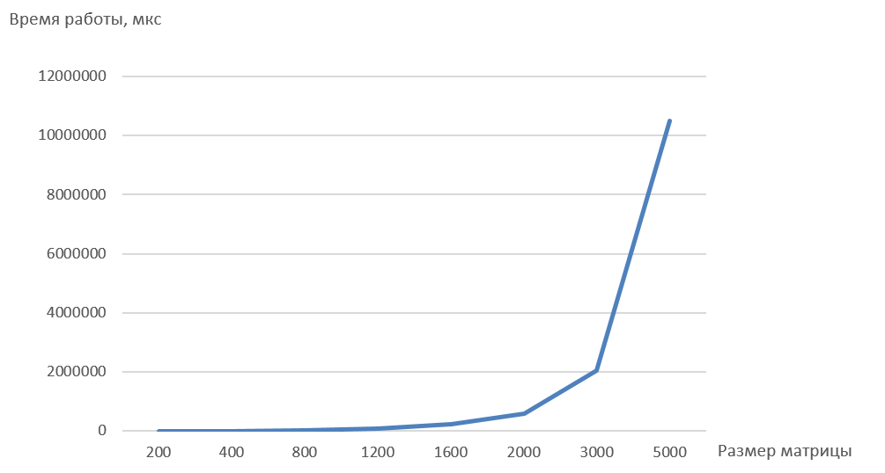

## Сырые данные времени работы (мкс)

| Размер матрицы | 200 | 400 | 800 | 1200 | 1600 | 2000 | 3000 | 5000 |
| :--- | ---: | ---: | ---: | ---: | ---: | ---: | ---: | ---: |
| Время работы | 2078 | 4897 | 24502 | 81454 | 215233 | 578869 | 2046350 | 10501684 |

## График времени работы

## Выводы

В ходе работы был правильно реализован алгоритм умножения квадратных матриц. Время работы алгоритма увеличивается вместе с размерами исходных матриц.
