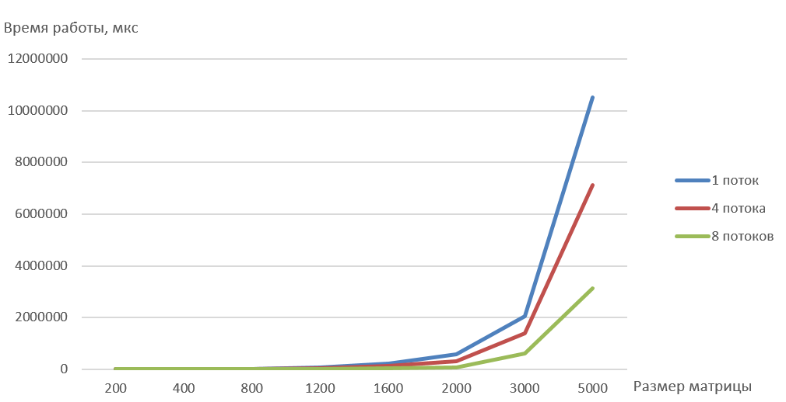

## Сырые данные времени работы (мкс)

| Кол-во потоков / Размер матрицы | 200 | 400 | 800 | 1200 | 1600 | 2000 | 3000 | 5000 |
| :--- | ---: | ---: | ---: | ---: | ---: | ---: | ---: | ---: |
| 1 | 2078 | 4897 | 24502 | 81454 | 215233 | 578869 | 2046350 | 10501684 |
| 4 | 1003 | 2447 | 14814 | 48264 | 136459 | 316464 | 1399830 | 7122898 |
| 8 | 1086 | 1633 | 6764 | 19161 | 44890 | 82716 | 596351 | 3120838 |

## График времени работы

## Выводы

Параллелизация по технологии OpenMP эффективна только при больших размерах матриц.
