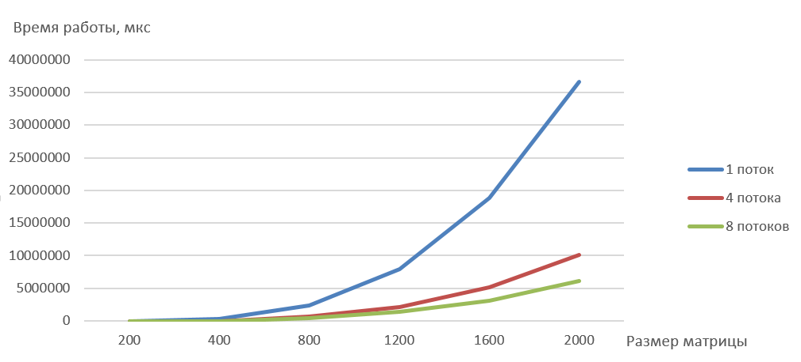

## Сырые данные времени работы (мкс)

| Кол-во потоков / Размер матрицы | 200 | 400 | 800 | 1200 | 1600 | 2000 |
| :--- | ---: | ---: | ---: | ---: | ---: | ---: | ---: | ---: |
| 1 | 37161.9 | 292329 | 2345640 | 7907820 | 18777200 | 36635300 |
| 4 | 10932.3 | 75984.3 | 660224 | 2156440 | 5198670 | 10065000 |
| 8 | 5287.6 | 46826.5 | 423103 | 1374320 | 3105430 | 6073120 |

## График времени работы

## Выводы

Параллелизация по технологии MPI уступает в скорости OpenMP, так как MPI создан для суперкомпьютеров и кластеров, где данные для обработки не помещаются (и следовательно OpenMP не работает) в памяти одного компьютера.
