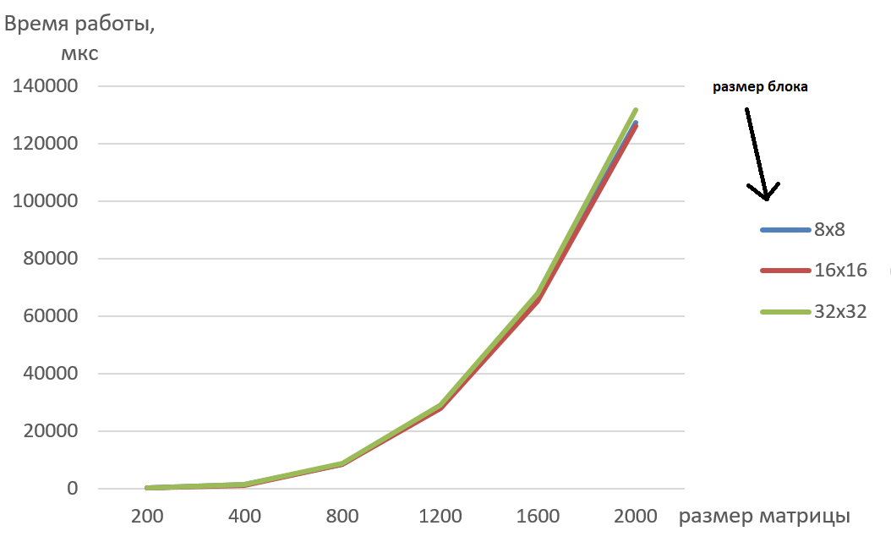

## Сырые данные времени работы (мкс)

| Размер матрицы/Размер блока | 8x8 | 16x16 | 32x32 |
| :---: | :---: | :---: | :---: |
| 200 | 372 | 341 | 356 |
| 400 | 1354 | 1291 | 1320 |
| 800 | 8645 | 8452 | 8791 |
| 1200 | 28540 | 27915 | 29204 |
| 1600 | 66530 | 65241 | 67988 |
| 2000 | 127488 | 126401 | 131805 |

## График времени работы

## Выводы

Параллелизация по технологии MPI обеспесивает значительное преимущество в производительности по сравнению с OpenMP/MPI.
